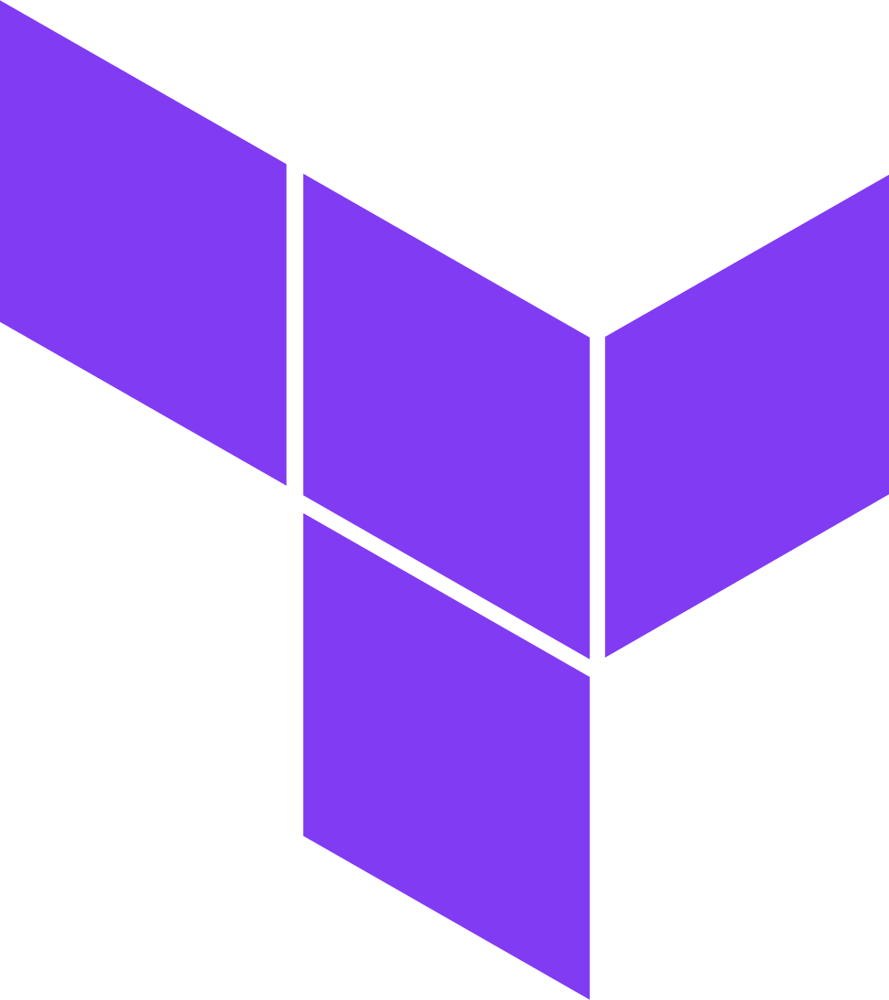

#  Terraform Actions

## [/terraform/scan](/terraform/scan/)

Scan your Terraform plan and remediate policy violations directly in your code

## [/terraform/remediate](/terraform/remediate/)

Remediate your Terraform code in GitHub

#  CloudFormation Actions

## [/cloudformation/scan](/cloudformation/scan/)

Scan your CloudFormation templates and remediate policy violations directly in your code  