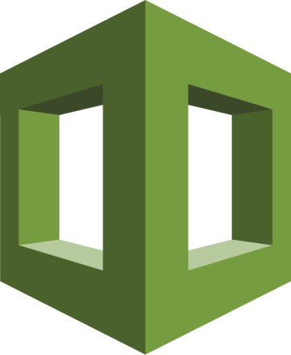

#  Gomboc.AI CloudFormation Scan Action

## When to use this action

Use this action:
- In a deployment workflow to get remediations to your CloudFormation templates. Optionally have remediations in a new PR or on your current branch
- Locally to get a set of observations about your CloudFormation templates.

## Setting up your workflow

Gomboc's CloudFormation Action requires a few settings to run on Github Actions.

---

Start by creating or expanding an existing workflow that you have, like so:

```
name: Gomboc.AI Cloudformation Scan

on:
  pull_request:
  push:
    branches: [ main ]

permissions:
  id-token: write
  contents: read

jobs:
  gomboc:
    runs-on: ubuntu-latest
    name: Gomboc Cloudformation Action
    steps:
      ...
```

---

Note the minimal set of permissions required:

| Permission | Description |
| --- | --- |
| `id-token: write` | Required to authenticate you in our service |
| `contents: read` | Required to read your CloudFormation templates |

---

Finally, add one or more Gomboc.AI actions:

```
- name: Gomboc.AI - CloudFormation Scan
  uses: Gomboc-AI/actions/cloudformation/scan@main
```

### Variables for side effects

| variable | Required | Default | Description | Additional permissions |
| --- | --- | --- | --- | --- |
| `gomboc-config` | No |  `gomboc.yaml` | Path to Gomboc's configuration file | N/A |
| `access-token` | No |   | Access token needed to perform API side effects (`secrets.GITHUB_TOKEN`) | N/A |
| `create-pr` | No |  `false` | Create a new PR with remediations | `contents: write` |
| `commit-on-current-branch` | No |  `false` | Commit remediations in existing PR | `contents: write` |

### Bring it all together

Your completed Gomboc.AI Cloudformation Workflow should look something like this:

```
name: Gomboc.AI CloudFormation

on:
  pull_request:
  push:
    branches: [ main ]

permissions:
  id-token: write
  contents: write

jobs:
  gomboc-cloudformation:
    runs-on: ubuntu-latest
    steps:
      - name: Gomboc.AI - CloudFormation Scan
        uses: Gomboc-AI/actions/cloudformation/scan@latest
        with:
          access-token: ${{ secrets.GITHUB_TOKEN }} 
          commit-on-current-branch: true
```

> **Note**
> `secrets.GITHUB_TOKEN` is provided by GitHub and can be used to authenticate on behalf of GitHub Actions. Read more about it [here](https://docs.github.com/en/actions/security-guides/automatic-token-authentication).

### About Gomboc.AI's configuration file

It is a YAML file that specifies different parameters for the scan action.

Here's an example:

```
policies: 
  must-implement:
    - Deletion Protection
    - Resource Tags
    - API Key Authentication
    - Provisioned Capacity
    - Request Tracing

options:
  search-pattern:
    - '**/*.{yaml,yml}'
    - '**/*.json'
  ignore-pattern:
    - 'my-private-directory/*'
    - 'tsconfig.json'
```

| Element | Required | Description |
| --- | --- | --- |
| <kbd>policies</kbd> | Yes | An object describing your policies |
| <kbd>policies.must-implement</kbd> | REQUIRED | A list of capabilities that will be enforced |
| <kbd>options</kbd> | Yes | An object containing additional settings |
| <kbd>options.search&#x2011;pattern</kbd> | Yes |  A list of search patterns to the CloudFormation templates. (JSON or YAML) |
| <kbd>options.ignore&#x2011;pattern</kbd> | No |  A list of patterns that will be ignored in the search. Gomboc's config file is ignored by default |
