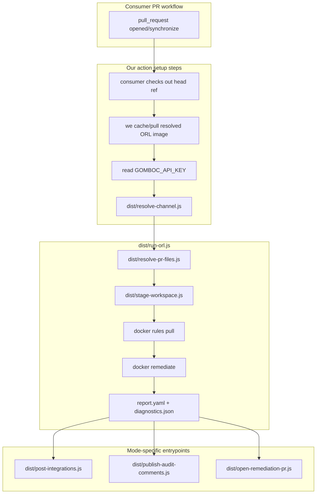

# ORL GitHub Action — implementation plan

## What this repo does

We maintain a **composite GitHub Action** (`action.yml`) that consumer workflows invoke on **pull requests**. The action runs entirely via Docker — no host `orl` binary.

| `mode` input | Behavior |
|--------------|----------|
| `audit` | Run ORL, post **inline PR review comments** on the triggering PR (no writes to the consumer repo) |
| `remediate` | Run ORL; if fixes exist, push a bot branch and **open a stacked PR** into the PR’s head branch |

Everything required to run, test, and document the action lives in **this repository**.



---

## Repository layout

```
.
├── action.yml                      # composite entry: inputs → node dist/*.js
├── README.md                       # consumer setup, secrets, permissions, limits
├── hooks/                          # ORL hook shell scripts (see table below)
├── src/                            # TypeScript implementation
│   ├── resolve-channel.ts
│   ├── resolve-pr-files.ts         # PR diff → scannable modified paths (SDK filter)
│   ├── stage-workspace.ts
│   ├── run-orl.ts                  # orchestrates pull + remediate
│   ├── normalize-report.ts
│   ├── post-integrations.ts
│   ├── publish-audit-comments.ts
│   ├── open-remediation-pr.ts
│   └── lib/                        # group-files-by-language, paths, docker, git, github api
├── dist/                           # compiled JS (committed on release tags)
├── tsconfig.json
├── package.json                    # build + test scripts; runtime deps
├── fixtures/
│   ├── rules/                      # rulespace for integration tests
│   ├── code/                       # sample IaC with known violations
│   └── reports/                    # golden report.yaml / diagnostics.json
├── tests/
│   ├── unit/
│   └── integration/                # requires Docker on runner
└── examples/
    └── consumer-workflow.yml       # copy-paste template for downstream repos
```

We implement orchestration in **TypeScript** under `src/`, compile to `dist/`, and invoke `node dist/<entry>.js` from `action.yml` (no VS Code runtime).

### TypeScript toolchain (ESM only)

We standardize on **ECMAScript modules** end-to-end — no CommonJS output.

| Piece | Choice |
|-------|--------|
| `package.json` | `"type": "module"` |
| `tsconfig.json` | `"module": "NodeNext"`, `"moduleResolution": "NodeNext"` (or `"Node16"`), `"target": "ES2022"` |
| Source imports | Use `.js` extensions in `src/` import paths (e.g. `import { x } from './lib/paths.js'`) so emitted `dist/` matches Node ESM resolution |
| Compile | `tsc` → `dist/` as native ESM (`.js` files with `import`/`export`) |
| Run in action | `node dist/run-orl.js` with `working-directory: ${{ github.action_path }}` (Node 24 on `ubuntu-latest`) |
| Entrypoints | One file per step (`dist/run-orl.js`, etc.) or shared `dist/cli.js`; avoid `require()` |
| Tests | `node --experimental-vm-modules` + vitest/jest ESM config, or `tsx` for integration scripts |
| SDK | `@gomboc-ai/gomboc-node-sdk` must be imported as ESM (`import { … } from '@gomboc-ai/gomboc-node-sdk'`) — verify package `exports` field supports our Node version |
| Release | **Commit `dist/`** on version tags so consumers never compile at runtime |
| CI | `npm run build` + `npm test`; fail if `dist/` is stale vs `src/` |
| Types | SDK where available; local `zod` for report/diagnostics parsing in v1 |

**Do not** emit CJS, use `"module": "commonjs"`, or mix `require()` in `src/`.

`action.yml` does **not** run `npm ci` on consumer workflows unless we explicitly add a dev-only path; production refs ship with `dist/` already built (including bundled/runtime `node_modules` for `@gomboc-ai/gomboc-node-sdk` — see [Dependency bundling](#dependency-bundling)).

Optional dev convenience: `npm run start -- src/run-orl.ts` via `tsx` for local runs without a full build loop.

---

## `@gomboc-ai/gomboc-node-sdk` integration

We depend on [`@gomboc-ai/gomboc-node-sdk`](https://github.com/Gomboc-AI/gomboc-node-sdk) (GitHub Packages: `@Gomboc-AI:registry`) and **reuse SDK exports** instead of reimplementing Gomboc-specific logic in this repo.

### Use from SDK today

| Concern | SDK export (use in our `src/`) |
|---------|--------------------------------|
| PR file filter | `isOrlScannableLanguageFile` — `resolve-pr-files.ts` (only modified paths) |
| Language detection + grouping | `detectLanguageId`, `mapLanguageIdToOrlLanguage` — `lib/group-files-by-language.ts` (PR file list only; no inputs) |
| Rules service (v1.1) | `initRulesServiceLoader` — optional channel existence / policy metadata in `resolve-channel.ts` |

Pin a released version (e.g. `^2.1.0`).

> **TODO (future — not in v1):** ORL will eventually include **file + line** on findings/fixes in `report.yaml`. That schema and any [`gomboc-node-sdk`](https://github.com/Gomboc-AI/gomboc-node-sdk) parsers are **not designed or built here yet**. After ORL + SDK ship the feature, revisit audit comment placement (report-first, diagnostics fallback) in a follow-up pass.

### Dependency bundling

Consumer workflows only checkout **their** repo. Our action must run with SDK available at `${{ github.action_path }}`:

- **Preferred:** compile/bundle so `dist/` + production `node_modules` are **committed on release tags** (or produced in our release workflow and attached to the tag).
- Document in `README.md` that maintainers run `npm ci && npm run build` before tagging.
- CI: verify `node dist/run-orl.js` resolves `@gomboc-ai/gomboc-node-sdk` from `github.action_path`.

---

## Audit comment placement (v1 vs future)

**v1 / Phase 2 (what we build now):** inline PR comments use **`diagnostics.json`** from hooks (`path` + `hunks[].startLine` or `resources[].startLine`), enriched with rule metadata from `report.yaml`. If no line resolves, fall back to a single summary PR comment.

**Future (placeholder — do not implement in initial action):** ORL report entries will carry **finding/fix line numbers**. That will become the preferred anchor source (likely via shared SDK helpers). Design and implementation wait until the ORL report schema and SDK exports exist.

We keep hooks enabled in all phases for diagnostics artifacts and as a fallback.

---

## ORL execution (our Docker contract)

ORL runs **only** inside Docker. `src/run-orl.ts` (entry `dist/run-orl.js`) owns both commands.

### Docker image resolution

We resolve the image ref in `action.yml` before any Docker steps:

1. If input `orl-image` is non-empty → use it as the full image ref (advanced override).
2. Else use `gombocai/orl:${orl-version}` where `orl-version` defaults to `v1.3.6`.

Both `orl-version` and `orl-image` are **optional**; consumers need not set either for production defaults.

Cache/load steps use the resolved ref (see [Docker image caching](#docker-image-caching-in-actionyml)).

### Step 1 — Rules pull

We pull rules into `$RUNNER_TEMP/orl-rules` (or a cache-restored path) before remediate:

```bash
mkdir -p "$RULES_DIR"

docker run --rm \
  --user "$(id -u):$(id -g)" \
  -v "$RULES_DIR:/output" \
  -e "RULE_SERVICE_TOKEN=${GOMBOC_API_KEY}" \
  "${ORL_IMAGE}" \
  rules pull \
  --url="${RULES_SERVICE_URL}" \
  --out=/output \
  --channel="${CHANNEL}"
```

- Resolve `CHANNEL` in `src/resolve-channel.ts` (see [Channel resolution](#channel-resolution)).
- Cache `$RULES_DIR` with `actions/cache`; key includes resolved `ORL_IMAGE`, `rules-service-url`, and channel. Honor `rules-cache-ttl-hours` (default **6**) before re-pulling.

Optional later: `--search='(eq $.name "rule-name")'` instead of `--channel` for targeted runs.

### Step 2 — Remediate

We stage a workspace under `$RUNNER_TEMP/orl-workspace`, then:

```bash
docker run --rm \
  --user "$(id -u):$(id -g)" \
  -v "$WORK_DIR:/workspace" \
  -v "$RULES_DIR:/workspace/rules" \
  "${ORL_IMAGE}" \
  remediate /workspace \
  --hooks-dir /workspace/.orl/hooks \
  --rulespace /workspace/rules \
  --language "${LANGUAGE}" \
  --out /workspace/.orl/report.yaml
```

| Flag | Why we pass it |
|------|----------------|
| `--hooks-dir` | Our `hooks/` emit `diagnostics.json` (audit fallback until report includes line numbers) |
| `--rulespace` | Pulled rules mount |
| `--language` | SDK auto-detect per batch (one remediate run per distinct ORL language in the PR file set) |
| `--out` | Stable report path we parse after the container exits |

- Enforce `scan-timeout-seconds` (default **90**): kill container on timeout, fail with explicit error.
- Do **not** use `--disable-hooks` in v1 (single-pass only).

### ORL exit codes (how we handle them)

| Code | Meaning | Our behavior |
|------|---------|--------------|
| 0 | Success | Continue to post-processing |
| 1 | Failed to execute | Fail the action step; `post-integrations.ts` sends error payload |
| 2 | Report has errors | Succeed with warning in job summary; still upload artifacts + Integrations |
| 3 | Fixes &lt; findings | Same as 2 |

### PR changed-files scope (`src/resolve-pr-files.ts`)

Scan scope is **only PR-changed, ORL-scannable files** — there is **no** `working-directory` input. A PR may touch `infra/`, `apps/api/`, etc.; we derive scope entirely from the diff.

1. After checkout of PR head, compute the changed path list:
   ```bash
   git diff --name-only "${BASE_SHA}" "${HEAD_SHA}"
   ```
   Use `github.event.pull_request.base.sha` and `head.sha` (`fetch-depth: 0` on checkout).
2. Filter with `@gomboc-ai/gomboc-node-sdk` **`isOrlScannableLanguageFile({ filePath })`**.
3. Apply **`max-changed-files`** cap (optional input, default **50**). If count exceeds cap → exit **1** with a clear message (split the PR or raise cap in advanced config). Do not silently truncate.
4. Persist manifest `modified-scannable-files.json` (paths + derived metadata) for later steps.

If the filtered list is **empty**, exit **0** (“no ORL-scannable files changed in this PR”) — skip Docker.

**Derived scan roots (internal, not an input):** compute unique top-level directories (or `.`) from the path list for logging and Integrations `reports[].path` when a single root applies; when paths span multiple roots, use `path: "."` and include the file list in report metadata / job summary.

### Workspace staging (`src/stage-workspace.ts`)

1. Create `$WORK_DIR` under `$RUNNER_TEMP/orl-workspace`.
2. Copy **only** paths from the PR changed-files list into `$WORK_DIR`, preserving repo-relative structure (create parent dirs as needed).
3. `mkdir -p "$WORK_DIR/.orl" "$WORK_DIR/rules"`.
4. Copy `hooks/*` → `$WORK_DIR/.orl/hooks/`.
5. After remediate, read `$WORK_DIR/.orl/report.yaml` and `$WORK_DIR/.orl/diagnostics/diagnostics.json`.

### `hooks/` scripts we maintain

| File | Role |
|------|------|
| `hooks/common.sh` | Shared helpers |
| `hooks/pre_remediate.sh` | Start-of-run manifest |
| `hooks/pre_remediate_rule_finding.sh` | Per-finding snapshot |
| `hooks/post_remediate_rule_finding.sh` | Per-finding post-change snapshot |
| `hooks/post_remediate_rule.sh` | Per-rule completion |
| `hooks/post_remediate.sh` | End-of-run manifest |

Output under `/workspace/.orl/diagnostics/` inside the container (on the host: `$WORK_DIR/.orl/diagnostics/`):

- `diagnostics.json` — file/line attribution fallback for audit comments
- `manifest.jsonl` — optional timing (one JSON line per event)

### Changed paths (`src/lib/extract-changed-paths.ts` or equivalent)

Parse `report.yaml` → for each rule in `spec.rules` (or `rules`):

1. Prefer keys of `files_changed`.
2. Else `files[].path`.

Normalize: strip `/workspace/`, `./`, leading `/`. Deduplicate.

In **remediate** mode, copy back only paths that are both (a) in the PR changed-files list and (b) reported as changed by ORL.

---

## Language detection and ORL batches (`src/lib/group-files-by-language.ts` + SDK)

There is **no** `language` input. Detection is always via [**`@gomboc-ai/gomboc-node-sdk`**](https://github.com/Gomboc-AI/gomboc-node-sdk):

1. For each path in `modified-scannable-files.json`, read content from the consumer checkout.
2. `detectLanguageId({ filePath, content })` → `mapLanguageIdToOrlLanguage({ languageId, filePath })`.
3. Group files by ORL language id. Drop unmapped paths (log warning per file).
4. If no groups remain → exit 1 (“changed files are not ORL-scannable”).

**`src/run-orl.ts`** runs **one remediate docker invocation per language group** (each with its own staged `$WORK_DIR` subset and `--language` flag). Merge or concatenate reports/diagnostics for post-steps (document merge rules in implementation).

This supports PRs that touch Terraform under `infra/` and YAML under `deploy/` without asking the consumer to configure roots or languages.

---

## Channel resolution (`src/resolve-channel.ts`)

Read `orl-channel` input and `GOMBOC_API_KEY`:

1. Non-empty `orl-channel` → use as-is.
2. Else decode JWT payload (middle segment, base64url) → `tenantId` claim.
3. If `tenantId` → `{tenantId}/accounts/default`.
4. **v1:** on decode failure or missing claim → `default`.
5. **v1.1 (roadmap):** `GET {rules-service-url}/api/v1/channels/get?name={candidate}`; 404 → `default`.

Write resolved channel to `$GITHUB_OUTPUT` for later steps.

---

## Integrations (`src/post-integrations.ts`)

Skip when `integrations-enabled` is `false`. Use `src/normalize-report.ts` before POST.

### When we POST

| Situation | Body |
|-----------|------|
| Report parsed after remediate | Full payload with `orlReport` |
| Pull/docker/timeout/parse failure | Error-only payload |

Integrations POST failures are **always non-blocking** (log + job summary warning; never fail the action step).

### Request

```
POST {integrations-service-url}/reporting/orl-external
Authorization: Bearer {GOMBOC_API_KEY}
Content-Type: application/json
Timeout: 10s
```

### Success body (v1.0)

```json
{
  "version": 1.0,
  "requestOrigin": "GITHUB_ACTION",
  "effect": "SubmitForReview",
  "reports": [
    {
      "path": "infra",
      "branch": "feature/my-branch",
      "orlReport": {},
      "github": {
        "repository": "org/repo",
        "prNumber": 42,
        "headSha": "abc123..."
      }
    }
  ],
  "errors": []
}
```

- Set `path` to the derived scan root when all changed files share one prefix; otherwise `"."` (repo root).
- Set `branch` from `github.head_ref`.
- Include `github` metadata so Integrations idempotency (SHA-256 of payload) does not drop re-runs on new commits — confirm backend accepts extra fields before v1 release.
- Append `errors` when we surfaced ORL warnings (exit 2/3).

### Error-only body

```json
{
  "version": 1.0,
  "requestOrigin": "GITHUB_ACTION",
  "effect": "SubmitForReview",
  "reports": [{ "path": "infra", "branch": "feature/my-branch" }],
  "errors": [{ "status": 500, "message": "ORL execution: ..." }]
}
```

Use `status: 400` for validation errors.

### `normalize-report.ts` output shape

- `type: "Report"`, `version: "v1"`
- `metadata.name`; `description` truncated to 500 chars
- Drop annotation keys containing: `example`, `graph`, `code-fix-id`, `resource-key`, `risk/statement`, `impact/statement`
- `workspace`, `language`, numeric `rules_applied`, `findings`, `fixes`, `changes`
- `errors` as string array
- Always set `rules: []` (counts only; keep payload small)

We do **not** call `/reporting/orl-fix-applied` in v1.

---

## Audit mode (`src/publish-audit-comments.ts`)

After `run-orl.ts` succeeds:

1. Run `post-integrations.ts`.
2. Parse `diagnostics.json` for file + line; enrich from `report.yaml` rule metadata.
3. Post inline review comments: `POST .../pulls/{n}/comments` with head SHA, repo-relative `path`, `line` from diagnostics.
4. Prefix bodies with `<!-- gomboc-orl-audit -->`; dedupe on `synchronize`; cap at `comment-max-per-pr`.
5. If no valid `path`+`line`, post one summary issue comment with counts from normalized report.

**Phase 1 MVP:** summary comment only.

**Phase 2:** inline comments from diagnostics (see [Audit comment placement](#audit-comment-placement-v1-vs-future)).

`diagnostics.json` shape we parse in Phase 2:

```json
{
  "version": 1,
  "generatedAt": "ISO-8601",
  "rules": [{
    "ruleName": "orl-rule:...",
    "priority": 0,
    "files": [{
      "path": "main.tf",
      "hunks": [{ "startLine": 12, "lineCount": 3, "type": "modified" }],
      "resources": [{ "type": "aws_s3_bucket", "name": "example", "startLine": 10, "endLine": 15 }]
    }]
  }]
}
```

If `fail-on-findings` is `true`, fail the step when normalized `findings > 0` or `changes > 0`.

---

## Remediate mode (`src/open-remediation-pr.ts`)

After `run-orl.ts`:

1. Copy changed paths into the consumer checkout.
2. If `git status --porcelain` is empty → exit 0 (“no fixes”).
3. Else:
   - Branch: `{remediation-branch-prefix}-{pr_number}` (default `gomboc/orl-remediation`)
   - Commit: `chore(gomboc): ORL remediation for PR #N`
   - Push to `origin`
   - `gh pr create --base {head_ref} --head {bot_branch}` (stacked into **feature branch**)
4. Run `post-integrations.ts`.

**Fork guard:** if `pull_request.head.repo.full_name != github.repository`, log warning and skip push (document in `README.md`; do not enable `pull_request_target` by default).

**Dedupe:** if a remediation PR already exists for this PR number, update it instead of creating another.

---

## `action.yml` inputs

### Configuration contract

- **Required:** `mode` only (`audit` | `remediate`).
- **Optional:** every other input has a `default` in `action.yml`. Omitted inputs must behave identically to the default.
- **Scripts:** read resolved values from env vars set by `action.yml` (e.g. `ORL_IMAGE`, `RULES_SERVICE_URL`), never hardcode URLs or image tags in `src/`.
- **README:** minimal consumer example shows only `mode` + `GOMBOC_API_KEY`; document overrides under “Advanced configuration”.

### Input reference (all optional except `mode`)

| Input | Required | Default | Notes |
|-------|----------|---------|-------|
| `mode` | yes | — | `audit` \| `remediate` |
| `max-changed-files` | no | `50` | Max PR-changed scannable files per run; fail if exceeded |
| `orl-channel` | no | `""` | Empty → resolve from JWT in `resolve-channel.ts` |
| `orl-version` | no | `v1.3.6` | Docker tag; image = `gombocai/orl:{orl-version}` |
| `orl-image` | no | `""` | Full image ref; when set, overrides `orl-version` |
| `rules-service-url` | no | `https://rules.app.gomboc.ai` | Passed to `rules pull --url=...` |
| `integrations-service-url` | no | `https://integrations.app.gomboc.ai` | Base URL for `/reporting/orl-external` |
| `integrations-enabled` | no | `true` | `false` skips `post-integrations.ts` |
| `scan-timeout-seconds` | no | `90` | Per remediate docker invocation |
| `rules-cache-ttl-hours` | no | `6` | Treat `actions/cache` rules hit as stale after this |
| `remediation-branch-prefix` | no | `gomboc/orl-remediation` | Remediate mode branch name prefix |
| `comment-max-per-pr` | no | `50` | Audit mode inline comment cap |
| `fail-on-findings` | no | `false` | Audit mode: fail when findings/changes &gt; 0 |

### `action.yml` inputs block (source of truth)

```yaml
inputs:
  mode:
    description: Run mode
    required: true
  max-changed-files:
    description: Maximum PR-changed ORL-scannable files to process
    required: false
    default: "50"
  orl-channel:
    description: Rules channel; empty = resolve from GOMBOC_API_KEY JWT
    required: false
    default: ""
  orl-version:
    description: ORL Docker image tag (used when orl-image is empty)
    required: false
    default: "v1.3.6"
  orl-image:
    description: Full Docker image ref; overrides orl-version when set
    required: false
    default: ""
  rules-service-url:
    description: Gomboc Rules Service base URL
    required: false
    default: "https://rules.app.gomboc.ai"
  integrations-service-url:
    description: Gomboc Integrations Service base URL
    required: false
    default: "https://integrations.app.gomboc.ai"
  integrations-enabled:
    description: POST scan results to Integrations
    required: false
    default: "true"
  scan-timeout-seconds:
    description: Timeout for each ORL remediate docker run
    required: false
    default: "90"
  rules-cache-ttl-hours:
    description: Max age before rules cache is refreshed
    required: false
    default: "6"
  remediation-branch-prefix:
    description: Branch prefix for remediate stacked PRs
    required: false
    default: "gomboc/orl-remediation"
  comment-max-per-pr:
    description: Maximum inline review comments per PR (audit)
    required: false
    default: "50"
  fail-on-findings:
    description: Fail when findings or changes are greater than zero (audit)
    required: false
    default: "false"
```

Early step resolves `ORL_IMAGE`:

```yaml
- id: orl-image
  shell: bash
  run: |
    if [ -n "${{ inputs.orl-image }}" ]; then
      echo "ref=${{ inputs.orl-image }}" >> "$GITHUB_OUTPUT"
    else
      echo "ref=gombocai/orl:${{ inputs.orl-version }}" >> "$GITHUB_OUTPUT"
    fi
```

Example step invoking compiled TypeScript entrypoints:

```yaml
- name: Run ORL
  shell: bash
  working-directory: ${{ github.action_path }}
  env:
    ORL_IMAGE: ${{ steps.orl-image.outputs.ref }}
    RULES_SERVICE_URL: ${{ inputs.rules-service-url }}
    # ...other inputs mapped to env
  run: node dist/run-orl.js
```

### Secret (consumer workflow)

| Secret | Our usage |
|--------|-----------|
| `GOMBOC_API_KEY` | `RULE_SERVICE_TOKEN` + Integrations Bearer |

### Docker image caching in `action.yml`

Use the resolved `steps.orl-image.outputs.ref` (not raw inputs) for pull/save/cache key:

```yaml
- uses: actions/cache@v4
  with:
    path: /tmp/orl-image.tar
    key: docker-${{ steps.orl-image.outputs.ref }}
- if: steps.cache.outputs.cache-hit != 'true'
  run: |
    docker pull ${{ steps.orl-image.outputs.ref }}
    docker save ${{ steps.orl-image.outputs.ref }} -o /tmp/orl-image.tar
- if: steps.cache.outputs.cache-hit == 'true'
  run: docker load -i /tmp/orl-image.tar
```

Rules cache key should include resolved `ORL_IMAGE`, `rules-service-url`, and `orl-channel` so overrides invalidate correctly.

### Artifacts we upload

Always attach from `$WORK_DIR`:

- `report.yaml`
- `diagnostics.json`
- `manifest.jsonl` (if present)

Job summary: findings / fixes / changes counts from normalized report.

---

## What we document for consumers (`README.md` + `examples/consumer-workflow.yml`)

**Trigger:**

```yaml
on:
  pull_request:
    types: [opened, synchronize, reopened]
```

**Checkout head** (enough history to diff against PR base):

```yaml
- uses: actions/checkout@v6
  with:
    ref: ${{ github.event.pull_request.head.sha }}
    fetch-depth: 0
```

**Permissions:**

```yaml
permissions:
  contents: read
  pull-requests: write
# remediate mode:
  contents: write
```

**Minimal usage** (all service URLs and ORL version use action defaults):

```yaml
- uses: gomboc-ai/gomboc-orl-action@v1
  with:
    mode: audit
  env:
    GOMBOC_API_KEY: ${{ secrets.GOMBOC_API_KEY }}
```

**Overrides** (only when needed):

```yaml
- uses: gomboc-ai/gomboc-orl-action@v1
  with:
    mode: remediate
    max-changed-files: 100
    orl-version: v1.3.6
    rules-service-url: https://rules.dev.gcp.gomboc.ai
    integrations-service-url: https://integrations.dev.gomboc.ai
    orl-channel: my-org/custom-channel
  env:
    GOMBOC_API_KEY: ${{ secrets.GOMBOC_API_KEY }}
```

`GITHUB_TOKEN` covers PR comments and `gh pr create` when permissions are set.

---

## Out of scope for v1

- **ORL report line-based comment anchors** (future ORL + SDK feature — placeholder only in this plan)
- Checkov / third-party verification
- Two-pass ORL (hooks disabled discovery pass)
- `/reporting/orl-fix-applied` analytics
- `pull_request_target` for fork PRs (mention as advanced, security-sensitive)

---

## Roadmap (after v1)

| Item | Target |
|------|--------|
| Inline audit comments (`diagnostics.json`) | Phase 2 |
| Report line anchors + SDK (TBD after ORL ships) | Future — not planned in initial build |
| Stacked remediate PR | Phase 3 |
| Rules channel preflight via `initRulesServiceLoader` | v1.1 |
| Smarter per-directory batching (optional separate runs per scan root) | v1.1 |
| `fail-on-findings` + channel API | Phase 4 |

---

## How we ship it

### Phase 1 — Runnable core

- [ ] `tsconfig.json`, `src/`, `npm run build` → `dist/`, CI checks `dist/` is up to date
- [ ] `action.yml` wires cache, then `resolve-pr-files` → `group-files-by-language` → `run-orl` (per language) → `post-integrations`
- [ ] Audit mode: summary PR comment only
- [ ] Artifacts + job summary

### Phase 2 — Audit inline comments

- [ ] `src/publish-audit-comments.ts` using `diagnostics.json` + report metadata
- [ ] Fixture: `fixtures/diagnostics/sample.json`

### Phase 3 — Remediate stacked PR

- [ ] `src/open-remediation-pr.ts` + fork guard

### Phase 4 — Hardening

- [ ] Channel API check, recursive staging, full integration suite

---

## How we verify

- **Unit** (`npm test` via vitest or node:test): `normalize-report`, changed-path extraction, JWT channel resolver — use `fixtures/` and tokens in tests against `src/`
- **Integration** (Docker required on CI): `fixtures/rules` + `fixtures/code` → expect parseable report, findings on violation sample, changed paths after remediate
- **Audit (Phase 2):** unit-test diagnostics → comment anchor mapping against `fixtures/diagnostics/`
- **Manual:** dogfood on a test PR; confirm Integrations payloads per commit; inline comments land on expected lines via diagnostics
