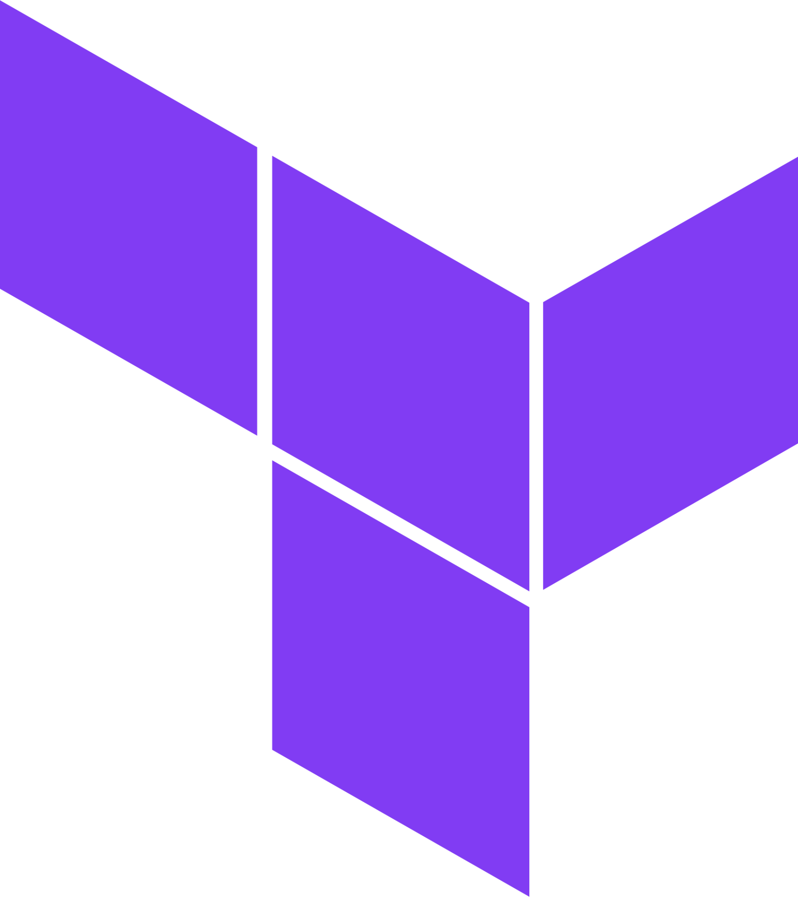

#  Gomboc.AI Terraform Remediate Action

## When to use this action

Use this action in a deployment workflow to get remediations to your Terraform code. 

## Quickstart guide 

We recommend starting with these two workflows:
  - **On Demand Execution**: Trigger our action from GitHub's UI for a quick healthcheck
  - **On Pull Requests**: Trigger our action everytime you make changes to your IaC

You can copy and paste these workflows from our [examples](/terraform/remediate/examples/). Otherwise, read on for more details.

## Setting up your own workflow

Your Gomboc.AI Terraform Remediate workflow should look something like this:

```
name: Gomboc.AI Terraform

on:
  pull_request:
  push:
    branches: [ main ]

jobs:
  gomboc:
    runs-on: ubuntu-latest
    steps:
      - name: Gomboc.AI - Terraform Remediate
        uses: Gomboc-AI/actions/terraform/remediate@main
        with:
          working-directory: tf/
          action: submit-for-review
```

## Variables

| Variable | Default | Description |
| --- | --- | --- |
| `working-directory` | `.` | The root directory for the Terraform configuration |
| `action` | (Required) | `direct-apply` will create a commit on the current branch.<br>`submit-for-review` will create a new PR. |
